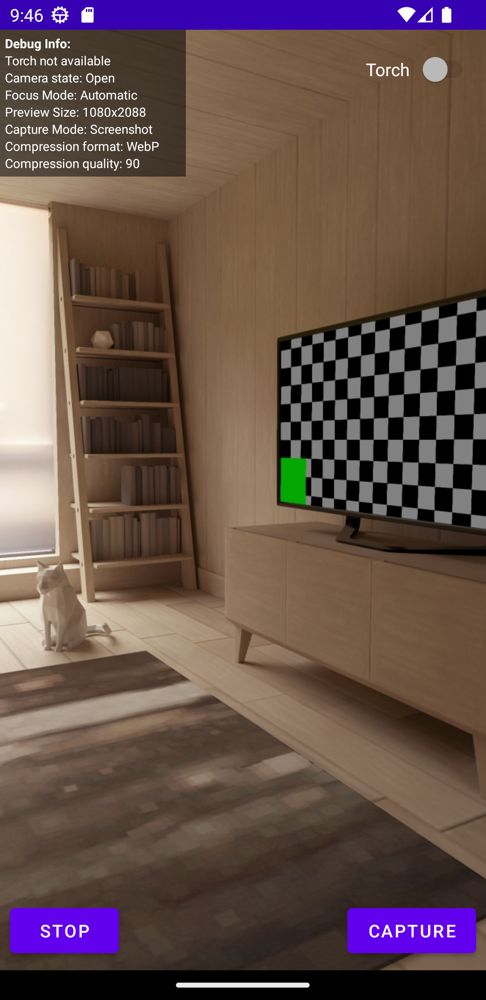

# 📷 nyris Camera SDK - Android

nyris Camera SDK is a library that offers a `CameraView` which allows you to take an optimized image for our nyris api.

On top of the optimization, the SDK Offers:

* Screenshot capturing: A feature to take faster a screenshot from the CameraPreview instead of relying on Lens but you
  lose in quality.
* Lens capturing: A feature to take a high-quality picture using a camera lens but in slow response time.
* Barcode capturing: it's a feature that allows scanning barcodes on the feed stream. The supported barcodes format are
  the following:
    * CODE_128
    * CODE_39
    * CODE_93
    * CODABAR
    * EAN_8
    * EAN_13
    * ITF
    * UPC_A
    * UPC_E
    * QR_CODE
    * PDF417
    * AZTEC
    * DATA_MATRIX
* Dynamic Camera View build: a Builder which offers an option to build the camera view based on the given parameters.
* Focus Control: a feature that allows you to control the focus manually or automatically.
* Debug Info: a debug feature that offers some debug information rendered on top of the camera.
* Lifecyle aware

## ⚠️ Requirements

* Min sdk: 21
* You need to handle the camera permission on your end. If you don't then you will just see a black screen.
* Activity of Fragment needs to be `LifecycleOwner`. The Camera SDK relies on Jetpack CameraX which is relying
  on `LifecycleOwner` implementation

## 💻 Install

```kotlin
// [Optional]: Needed only if you have access to this repo
maven {
    url = uri("https://maven.pkg.github.com/nyris/sdk-kmp")
}

implementation("io.nyris.sdk:camera-view:1.0.0")
// [Optional]: needed only when you need to use barcode scanning
implementation("io.nyris.sdk:camera-feature-barcode:1.0.0")
```

## 🏗️️ Usage

### How to use CameraView in XML file ?

By default if you don't specify the view parameters, the camera will start with:

* Capture Mode: Screenshot - (Screenshot, Lens, Barcode)
* Compression format: WebP - (WebP or JPEG)
* Compression quality: 90 - (Quality need to be between 10-100)
* Focus Mode: Automatic - (Automatic or Manual)
* Barcode format: ALL - (Check the list above)

```
<FrameLayou>
    <io.nyris.sdk.camera.CameraView 
        android:layout_height="match_parent" 
        android:layout_width="match_parent"
        app:barcode_format="all" 
        app:capture_mode="screenshot" 
        app:compression_format="webp" 
        app:focus_mode="automatic"
        app:quality="90" />
</FrameLayou>
```

### How to use CameraView in Kotlin/Java file ?

```kotlin
val cameraView = CameraViewBuilder(binding.cameraContainer) // Set your view group or camera container
    .captureMode(CaptureMode.Screenshot) // Set the capture mode [Lens, Screenshot and Barcode]
    .focusMode(FocusMode.Automatic) // Set the focus mode 
    .barcodeFormat(BarcodeFormat.All) // Set the target barcode format
    .barcodeGuide(false) // Disable / Enable barcode ui guide | Available only on kotlin not in xml attrs. 
    .compressionFormat(CompressionFormat.WEBP) // Set the compression
    .quality(90) // This will crash if the value is not between 10-100
    .build().apply {
        showDebug(true) // Enabled / Disable debug information
    }
```

## ✨ Demos

Please check our [demos](../../sdk.demos/android) project or this [video](demo.webm).

## 🔬 Debug/Logs


To Enable Camera Debug logs, you just need to:

```kotlin
cameraView.showDebug(true)
```

This will allows you to get a small view on top of the camera preview that shows different logs.

## 📄 Docs

### How to enable torch ?

To start using the camera torch, you need first to subscribe to its state changes.

```kotlin
cameraView.torchState { state ->
    //state == null // Means that the torch is not available on this device
    //state == true // Means torch is enabled
    //state == false // Meas torch is disabled
}

cameraView.enableTorch()
cameraView.disableTorch()
```

### How I can capture an image or barcode ?

For barcode:

```kotlin
cameraView.capture(BarcodeResult::class) { result ->
    result.code // Represents the barcode value
    result.format // Represents the barcode format
}
```

For Image:

```kotlin
cameraView.capture(ImageResult::class) { result ->
    result.optimizedImage // Represents the byte array that needs to be sent to nyris api
    result.originalImage // Represents the original byte array
}
```

!!Note!!: The capture method work properly only when you set the correct CaptureMode. For instance, if the capture mode
is the Screenshot and capture method expecting barcodes then capturing will not work properly!

### How I can subscribe to Camera Errors ?

```kotlin
cameraView.error { error ->
    Toast.makeText(
        this@CameraActivity,
        error.message,
        Toast.LENGTH_SHORT
    ).show()
}
```

Supported error codes:

* `CAMERA_ERROR_UNKNOWN`: When an exception is fired and not handled
* `CAMERA_ERROR_BIND`: When the camera is trying to start
* `CAMERA_ERROR_CAPTURE_NOT_AVAILABLE`: When the capture feature is not available
* `CAMERA_ERROR_CAPTURE_LENS`: When the lens camera feature is not able to start or fires an exception.
* `CAMERA_ERROR_CAPTURE_SCREENSHOT`: When the screenshot camera feature fires an exception.
* `CAMERA_ERROR_BACK_CAMERA_NOT_AVAILABLE`: When the camera back lens is not available.
* `CAMERA_ERROR_MANUAL_FOCUS`: When manual focus fires an exception.
* `CAMERA_ERROR_STATE`: When the camera is unable to start.
* `CAMERA_BARCODE_ERROR`: When the barcode feature fires an exception.

### How I can stop Camera Preview ?

```kotlin
cameraView.stop()
```

### How I can start the camera after I stop the resume or after the user grants me camera permission ?

```kotlin
cameraView.start()
```

### How I can release the camera while I'm destroying my activity ?

```kotlin
override fun onDestroy() {
    super.onDestroy()
    cameraView?.release()
}
```

### Can I override the existing resources in the Camera SDK ?

Yes, you can just need to add this names to your app and the desired values!

```
colors.xml
<resources>
    <color name="nyris_barcode_box_stroke">YOUR_COLOR</color> // Barcode stroke
    <color name="nyris_barcode_overlay_background">YOUR_COLOR</color> //Barcode overlay 
    <color name="nyris_barcode_format_text">YOUR_COLOR</color> // Barcode label
</resources>

dimens.xml
<resources>
    <dimen name="nyris_barcode_box_width">YOUR_DIM</dimen> // Stroke width
    <dimen name="nyris_barcode_box_radius">YOUR_DIM</dimen> // Stroke radius
    <dimen name="nyris_barcode_format">YOUR_DIM</dimen> // Barcode label size
</resources>

strings.xml
<resources>
    <string name="nyris_barcode_format_label">Barcode format</string>
    <string name="nyris_barcode_format_unknown">UNKNOWN</string>
    <string name="nyris_barcode_format_all">ALL</string>
    <string name="nyris_barcode_format_code_128">CODE-128</string>
    <string name="nyris_barcode_format_code_39">CODE-39</string>
    <string name="nyris_barcode_format_code_93">CODE-93</string>
    <string name="nyris_barcode_format_codebar">CODABAR</string>
    <string name="nyris_barcode_format_ean_8">EAN-8</string>
    <string name="nyris_barcode_format_ean_13">EAN-13</string>
    <string name="nyris_barcode_format_ean_itf">ITF</string>
    <string name="nyris_barcode_format_upc_a">UPC-A</string>
    <string name="nyris_barcode_format_upc_e">UPC-E</string>
    <string name="nyris_barcode_format_pdf417">PDF417</string>
    <string name="nyris_barcode_format_qr_code">QR-CODE</string>
    <string name="nyris_barcode_format_aztec">AZTEC</string>
    <string name="nyris_barcode_format_data_matrix">DATA-MATRIX</string>
</resources>
```

### Can I use two captures mode at the same time ?

No, you can't. The camera supports only 1 capture mode at the same time.

## 📜 License

    Copyright 2023 nyris GmbH
    
    Licensed under the Apache License, Version 2.0 (the "License");
    you may not use this file except in compliance with the License.
    You may obtain a copy of the License at
    
       http://www.apache.org/licenses/LICENSE-2.0
    
    Unless required by applicable law or agreed to in writing, software
    distributed under the License is distributed on an "AS IS" BASIS,
    WITHOUT WARRANTIES OR CONDITIONS OF ANY KIND, either express or implied.
    See the License for the specific language governing permissions and
    limitations under the License.``